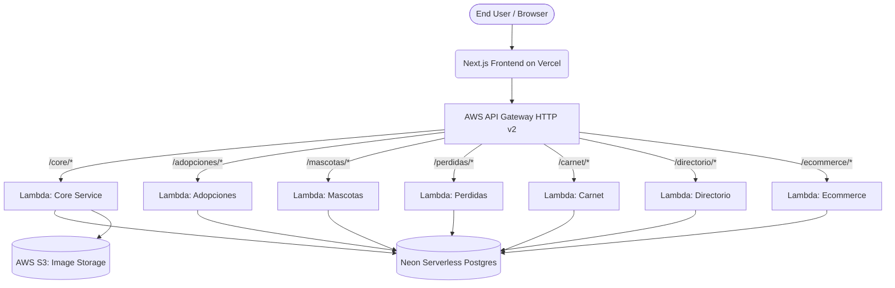

# Michicondrias AWS Architecture

**Michicondrias** platform runs on a modern, 100% serverless architecture designed to be massively scalable, cost-efficient (Free Tier friendly), and easy to maintain.

## High Level Overview

Below is the diagram representing how traffic flows from the end-user up to the underlying PostgreSQL Database:

## Core Components

### 1. Frontend (Next.js on Vercel)
The user interface is built using **Next.js 14** (App Router) and deployed on **Vercel**. All data fetching goes through the `NEXT_PUBLIC_API_URL` environment variable dynamically pointing to the AWS API Gateway.

### 2. API Gateway (AWS)
Acts as the single entry point (`https://kowly51wia.execute-api.us-east-1.amazonaws.com`) to all our backend microservices.
- **Protocol**: HTTP API (v2)
- **CORS Handling**: Handled natively by API Gateway to resolve `OPTIONS` preflight requests from Vercel.
- **Routing**: Maps routes using `$default` catches or prefixes to the respective AWS Lambda function.

### 3. Backend (FastAPI + Mangum on AWS Lambda)
The backend is composed of **7 independent microservices** written in Python (FastAPI). 
Since FastAPI requires an ASGI server (like Uvicorn) to run, we implemented **Mangum**, an adapter that wraps the FastAPI app and translates AWS API Gateway/Lambda events into ASGI scope requests.

*Features:*
- Isolated environments per logical function (Adopciones, Mascotas, Ecommerce, etc.).
- 15 second timeout to handle "Cold Starts".

### 4. Database (Neon Serverless Postgres)
We migrated away from local Postgres blocks into **Neon**, a Serverless Postgres DB.
- Re-scales to zero automatically when inactive.
- Synchronized dynamically using `Alembic` via Python migrations from our local repo to the Neon cloud.

### 5. Media Storage (AWS S3)
A single S3 Bucket (`michicondrias-files`) to securely upload and host public imagery, KYC Documents, and pet pictures, avoiding issues with Lambda's Read-Only file system restrictions.
