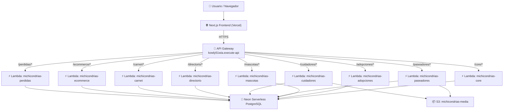

# Arquitectura General

Antes de crear una nueva Lambda, es importante entender cómo fluye una request de principio a fin en Michicondrias.

## Diagrama de Flujo



## ¿Por qué esta arquitectura?

| Decisión | Razón |
|---|---|
| **Lambda** | Pago por uso. Sin servidores que mantener. Escala automática de 0 a miles de requests. |
| **API Gateway** | Un solo dominio para todos los microservicios. Enrutamiento por path (`/core`, `/adopciones`) |
| **Mangum** | Adaptador Python que convierte FastAPI (ASGI) en una función Lambda compatible |
| **Neon PostgreSQL** | Base de datos serverless. Escala a cero cuando no hay actividad. Compartida entre servicios |
| **S3** | Almacenamiento de imágenes barato ($0.023/GB), escalable, y con presigned URLs para uploads directos |
| **GitHub Actions** | CI/CD automático: cada push a `main` empaqueta y despliega todos los servicios en paralelo |

## ¿Qué es Mangum y por qué lo necesitamos?

FastAPI es un framework **ASGI** (asíncrono). Normalmente necesita un servidor como Uvicorn para correr. Pero Lambda no tiene un servidor web — recibe eventos JSON.

**Mangum** es el puente entre ambos mundos:

```python
from mangum import Mangum
from fastapi import FastAPI

app = FastAPI(...)

# Mangum traduce:
# Evento Lambda → Request ASGI → FastAPI procesa → Response Lambda
handler = Mangum(app)
```

Cuando AWS Lambda recibe una request de API Gateway, invoca `handler(event, context)`. Mangum descompone el evento en una request HTTP normal que FastAPI puede procesar, y luego traduce la respuesta de FastAPI al formato que API Gateway espera.

## Estructura de un microservicio

Todos los microservicios siguen exactamente esta estructura:

```
michicondrias_{servicio}/
├── app/
│   ├── main.py          ← FastAPI app + Mangum handler
│   ├── api/
│   │   ├── main.py      ← Router principal (agrupa sub-routers)
│   │   ├── deps.py      ← Dependencias: auth JWT, roles
│   │   └── routes/
│   │       └── {recurso}.py  ← Endpoints del recurso
│   ├── core/
│   │   ├── config.py    ← Settings (DB, AWS, secrets)
│   │   └── s3.py        ← Presigned URL generation
│   ├── db/
│   │   └── session.py   ← SQLAlchemy engine + session
│   └── models/
│       ├── base.py      ← UUID BaseModel con timestamps
│       └── {recurso}.py ← Modelos SQLAlchemy
└── requirements.txt     ← Dependencias Python
```
